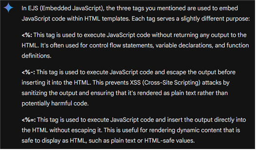
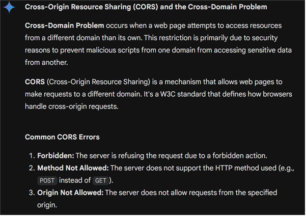

## Ejs Tutorial
ejs에서 javascript를 실행할 때 ``<%, <%-, <%=``의 사용에서는 차이점이 있다.


다음과 같이 사용한다. 
```html
...
<body>
    <%-include('../inc/Top.ejs') %>
    <hr />
    <div class="container">
        <h2>Member</h2>
        <p>
            <%= user.name %>님 반갑습니다 (<%= user.email %>)<br/>
            <a href="/logout">Logout</a>
        </p>
...
```


## Calling js file to ejs
다음 코드를 통해 클라이언트에 javascript를 제공할 수 있다. 

```js
// Route to serve the JavaScript file
app.get('/js/editManager', (req, res) => {
    res.sendFile(path.join(__dirname, 'public/resources/js/editManager.js'));
});

app.get('/js/empListManager', (req, res) => {
    res.sendFile(path.join(__dirname, 'public/resources/js/empListManager.js'));
});
```
(server-side)

```html
<!DOCTYPE html>
<html lang="en">
<head>
    <meta charset="UTF-8">
    <title>Title</title>
    <link rel="stylesheet" href="../public/resources/css/home.css">
</head>
<body>
<script src="https://cdn.jsdelivr.net/npm/axios/dist/axios.min.js"></script>
<script src="/js/empListManager"></script>
<h1>Employee Management System</h1>
empName : <input type="text" id="inpEmpName">
dept : <input type="text" id="inpDept">
grade : <input type="text" id="inpGrade">
<button id="addEmployee">Add Employee</button>
<hr>
<table>
    <tr>
        <th>empNo</th>
        <th>empName</th>
        <th>dept</th>
        <th>grade</th>
        <th>edit</th>
        <th>delete</th>
    </tr>
    <% data.forEach( (curPeople) => { %>
        <tr>
            <td id="empNo"><%= curPeople.empNo %></td>
            <td><%= curPeople.empName %></td>
            <td><%= curPeople.dept %></td>
            <td><%= curPeople.grade %></td>
            <td><button class="editButton">edit</button></td>
            <td><button class="deleteButton">delete</button></td>
        </tr>
    <% }); %>
</table>
</body>
</html>
```
(client-side)

## Using Router to get html
Router를 활용하여 html 데이터를 라우팅 할 수 있다.{} 부분에 요소들을 삽입하면 ejs쪽으로 데이터를 넘길 수 있다. **단, 사용 시 app.use에 해당 라우터를 할당해야 한다!**
```js
const router = express.Router();
app.use('/', router);
router.route("/home").get((req,res)=> {
    req.app.render("home/Home", {}, (err, html)=>{
        if (err) {
            console.error(err);
            res.status(500).send("Error rendering the page");
        } else {
            res.end(html);
        }
    });
});
```

## Using ErrorHandler to give 404 html when 404 error
```js
const expressErrorHandler = require('express-error-handler');
//모든 라우터 처리 후 404 오류 페이지 처리
const errorHandler = expressErrorHandler({
    static : {
        '404':'./public/404.html'
    }
});
app.use(expressErrorHandler.httpError(404) );
app.use(errorHandler);
```

## Using Cookie Parser to send cookie
```js
const cookieParser = require('cookie-parser');
app.use(cookieParser());
router.route("/login").get((req,res)=> {
    req.app.render("member/Login", {}, (err, html)=>{
        // 사용자(접속자)의 로컬에 쿠키가 저장 된다.
        res.cookie('user', {
            id:'TestUser',
            name: '테스트 유저',
            authorized: true
        });
        res.end(html);
    });
});
```

## Using Session to request login
쿠키는 response로 사용자 쪽에 전달하고, 세션은 request로 서버 쪽으로 전달된다.
```js
const expressSession = require("express-session");

app.use(expressSession({
    secret: 'my key',
    resave: true,
    saveUninitialized: true
}));

router.route("/login").post((req,res)=> {
    console.log(req.body.id, req.body.password);
    const idx = memberList.findIndex(member=>member.id===req.body.id);
    if(idx != -1) {
        if(memberList[idx].password === req.body.password) {
            console.log("로그인 성공!");
            // 세션에 로그인 정보를 등록 후 멤버 페이지 이동
            req.session.user = {
                id: req.body.id,
                name: memberList[idx].name,
                email: memberList[idx].email,
                no: memberList[idx].no
            }
            res.redirect("/member");
        } else {
            console.log("로그인 실패! 패스워드가 맞지 않습니다.");
            // 다시 로그인 페이지로 다시 이동
            res.redirect("/login");
        }
    } else {
        console.log("존재하지 않는 계정입니다.");
        res.redirect("/login");
    }
});
```

## Implementing Logout by Destroying the Session
```js
router.route("/logout").get((req, res)=>{
    console.log("GET - /logout 호출 ...");
    // 로그인 된 상태라면 로그아웃
    if(!req.session.user) {
        console.log("아직 로그인 전 상태입니다.");
        res.redirect("/login");
        return;
    }
    // 세션의 user 정보를 제거 해서 logout처리
    req.session.destroy((err)=>{
        if(err) throw err;
        console.log("로그아웃 성공!");
        res.redirect("/login");
    });
});

```

## CORS problem
CORS는 페이지가 보안상의 이유로 웹 서버의 서로 다른 도메인(경로)에서 데이터를 주고 받을 수 없도록 규제하는 것을 말한다. 서로 다른 도메인에서 서로 다른 포트 번호를 할당하여 동작하고 있기 때문에 서로 접근이 불가능.



이는 단순히 cors()로 해결할 수 있다. 

```js
const express = require('express');
const cors = require('cors');

const app = express();

// Enable CORS for all routes
app.use(cors());
```
