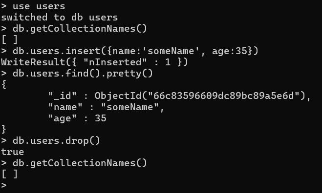

## Uploading file using POST 

multer와 fs를 활용하여 파일을 POST할 수 있다. 

```js
const http = require('http');
const express = require('express');
const app = express();
const router = express.Router();
// Express의 미들웨어 불러오기
const bodyParser = require('body-parser');
// 파일 업로드용 미들웨어
const multer = require('multer');
const fs = require('fs');

app.set('port', 3000);

// 파일 업로드는 post 방식으로 전송 됨.
app.use(bodyParser.urlencoded({ extended: false }));
app.use(bodyParser.json());
// 외부 접속 가능하도록 ststic 설정
app.use(express.static('public'));
app.use(express.static('uploads'));

// multer 업로드 설정
// multer 미들웨어 사용: 미들웨어 사용 순서 
// body-parser -> multer -> router 순으로 실행
var storage = multer.diskStorage({
    destination: function (req, file, callback) {
        callback(null, 'uploads');
    },
    filename: function (req, file, callback) {
        //callback(null, file.originalname + Date.now());
        // 파일명 중복을 방지하기 위한 처리
        // Date.now() <-- 타임스템프
        let index = file.originalname.lastIndexOf(".");
        let newFileName = file.originalname.substring(0, index);
        newFileName += Date.now();
        newFileName += file.originalname.substring(index);
        callback(null, newFileName);
    }
});
// 파일 제한: 10개, 1G 이하
var upload = multer({
    storage: storage,
    limits: {
        files: 10,
        fileSize: 1024 * 1024 * 1024
    }
});

router.route('/process/photo').post(upload.array('photo', 1), (req, res) => {
    console.log('POST - /process/photo 호출');
    try {
        var files = req.files;

        console.dir('#===== 업로드된 첫번째 파일 정보 =====#')
        console.dir(req.files[0]);
        console.dir('#=====#')

        // 현재의 파일 정보를 저장할 변수 선언
        let originalname = '';
        let filename = '';
        let mimetype = '';
        let size = 0;

        if (Array.isArray(files)) {
            // 배열에 들어가 있는 경우 (설정에서 1개의 파일도 배열에 넣게 했음)
            console.log("배열에 들어있는 파일 갯수 : %d", files.length);

            // files의 요소가 여러개이면 반복
            for (var index = 0; index < files.length; index++) {
                originalname = files[index].originalname;
                filename = files[index].filename;
                mimetype = files[index].mimetype;
                size = files[index].size;
            } // end of  for
        } else {
            // else  부분 계속 이어서 작성 ....
            // 배열에 들어가 있지 않은 경우 (현재 설정에서는 해당 없음)
            console.log("파일 갯수 : 1 ");

            originalname = files[index].originalname;
            filename = files[index].name;
            mimetype = files[index].mimetype;
            size = files[index].size;
        } // end  of  if~else

        console.log('현재 파일 정보 : ' + originalname + ', ' + filename + ', ' + mimetype + ', ' + size);

        // 클라이언트에 응답 전송
        res.writeHead('200', { 'Content-Type': 'text/html;charset=utf8' });
        res.write('<h3>파일 업로드 성공</h3>');
        res.write('<hr/>');
        res.write('<p>원본 파일명 : ' + originalname + ' -> 저장 파일명 : ' + filename + '</p>');
        res.write('<p>MIME TYPE : ' + mimetype + '</p>');
        res.write('<p>파일 크기 : ' + size + '</p>');
        res.end();

    } catch (err) {
        console.dir(err.stack);
        res.end('File upload error!');
    } // end of try~catch
});

app.use('/', router);
const server = http.createServer(app);
server.listen(app.get('port'), () => {
    console.log(`서버 실행 중>>> http://localhost:${app.get('port')}`);
});
```

## img preview setting 
```js
var myFileInput = document.getElementById("photo");
myFileInput.onchange = function(evt) {
	var input = evt.target;
	if(input.files && input.files[0]) {
		// 비동기 방식이다. 이미지가 다 읽어 졌는지 체크 한다. (xhr와 작동 유사하다.)
		var prevImg = document.getElementById("prev_img");
		prevImg.innerHTML = "";
		console.log(input.files.length);
		for(var i=0; i<input.files.length; i++) {
			var reader = new FileReader();
			reader.onload = function(e) {
				// 실행 결과 처리
				var imgTag = document.createElement("img");
				imgTag.src = e.target.result;
                imgTag.style.width="100px";
				prevImg.appendChild(imgTag);
			}
			// Ajax엣와 같이 실행 함수, 실행 결과 처리 함수가 있다.
			//console.log(input.files[0]);
			reader.readAsDataURL(input.files[i]);
		}
	}
}
```

## MongoDB interaction on CMD


## MongoDB connection 
```js
/*
var MongoClient = require('mongodb').MongoClient;
MongoClient.connect('mongodb://localhost', { useUnifiedTopology: true }, function (err, client) { 
    if (err) throw err; 
    var db = client.db('vehicle'); 
    db.collection('car').findOne({}, function (findErr, result) { 
        if (findErr) throw findErr; 
        console.log(result.name, result.price); 
        client.close(); 
    }); 
});
*/
const http = require('http');
const express = require('express');
const app = express();
const MongoClient = require('mongodb').MongoClient;

app.set('port', 3000);

app.set('view engine', 'ejs');
app.set('views', __dirname + "/views");

let db = null;

const connectionDB = () => {
    // 데이터베이스 연결 정보
    var databaseUrl = 'mongodb://localhost:27017';
    // 데이터베이스 연결
    MongoClient.connect(databaseUrl, {useUnifiedTopology: true}, function (err, database) {
        if (err) { throw err; }
        console.log('데이터베이스에 연결되었습니다. : ' + databaseUrl);
        // database 변수에 할당할때
        // 몽고디비3 이상에서는 db명을 지정해 주어야 한다.
        db = database.db('vehicle');
    });
}

app.get('/car', (req, res) => {
    if(db!==null) {
        const car = db.collection('car');
        car.find({}).toArray(function(err, carList) {
            //console.log(carList);
            req.app.render('car_list', {carList}, (err, html) => {
                res.end(html);
            });
        });
    }
});

const server = http.createServer(app);
server.listen(app.get('port'), () => {
    console.log("서버 실행 중 ...");
    connectionDB();
});
```

