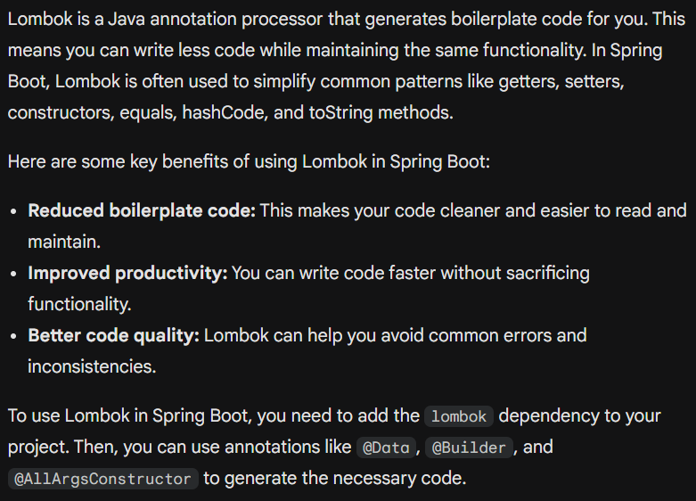
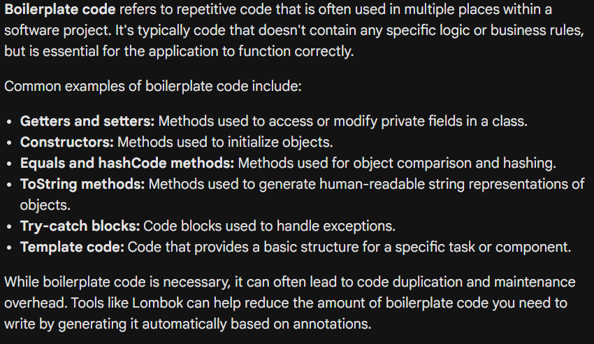
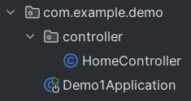
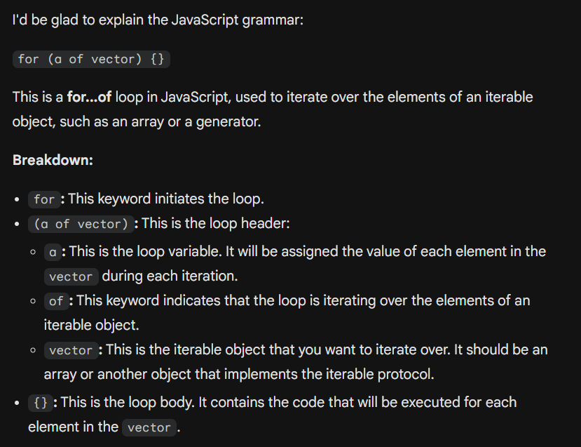

## Hugging face API
```html
<!DOCTYPE html>
<html lang="en">
<head>
    <meta charset="UTF-8">
    <meta http-equiv="X-UA-Compatible" content="IE=edge">
    <meta name="viewport" content="width=device-width, initial-scale=1.0">
    <title>Image Upload and Description using Hugging Face</title>
    <style>
        #imagePreview {
            max-width: 300px;
            max-height: 300px;
            display: block;
            margin-bottom: 10px;
        }
    </style>
</head>
<body>
<h1>Upload an Image</h1>
<input type="file" id="imageInput" accept="image/*">
<br><br>

<h2>Image Description:</h2>
<p id="imageDescription"></p>

<script>
    document.getElementById('imageInput').addEventListener('change', async function(event) {
        const file = event.target.files[0];

        if (file) {
            // 이미지를 미리 보기
            const reader = new FileReader();
            reader.onload = async function(e) {
                const imgElement = document.getElementById('imagePreview');
                imgElement.src = e.target.result;
                imgElement.style.display = 'block';

                // Base64 인코딩된 이미지 데이터 가져오기
                const base64Image = e.target.result.split(',')[1]; // "data:image/jpeg;base64," 접두사를 제거

                // Hugging Face API 토큰 설정
                const HF_TOKEN = 'ADD_YOUR_TOKEN_HERE';

                try {
                    // 이미지 설명 생성 모델 호출
                    const response = await fetch('https://api-inference.huggingface.co/models/nlpconnect/vit-gpt2-image-captioning', {
                        method: 'POST',
                        headers: {
                            'Authorization': `Bearer ${HF_TOKEN}`,
                            'Content-Type': 'application/json'
                        },
                        body: JSON.stringify({
                            inputs: base64Image // 수정된 Base64 이미지 데이터
                        })
                    });

                    if (!response.ok) {
                        throw new Error(`HTTP error! status: ${response.status}`);
                    }

                    const result = await response.json();

                    // 생성된 이미지 설명 표시
                    document.getElementById('imageDescription').innerText = result[0].generated_text;
                } catch (error) {
                    console.error('Error during image description generation:', error);
                    document.getElementById('imageDescription').innerText = 'An error occurred while generating the description.';
                }
            };
            reader.readAsDataURL(file); // 이미지 파일을 Base64로 읽어오기
        }
    });
</script>
</body>
</html>

```

## MongoDB Connection
```js
const { MongoClient } = require('mongodb');

// MongoDB atlas database connection
const uri = "mongodb+srv://<credentials>@cluster0.51eetbs.mongodb.net/?appName=mongosh+2.3.0"
const client = new MongoClient(uri);
async function run() {
    try {
        await client.connect();
        const database = client.db("testdb");
        const collection = database.collection("testcol");

        // save new Document
        const doc = { name: "김범준", age: 23 };
        const result = await collection.insertOne(doc);
        console.log(`A document was inserted with the _id: ${result.insertedId}`);

        // fetch the document
        const query = { _id: result.insertedId };
        const fetch = await collection.findOne(query);
        console.log("Fetched document:", fetch);
    } finally {
        await client.close();
    }
}
run().catch(console.dir);

```
## MongoDB Function usage

### 기본 MongoDB function이다.
1. 데이터베이스 생성 : ```use [DBName]```
2. 데이터 하나 저장 : ```db.[DBName].[insertOne|insertMany]({JSONFormat})```
3. Collection에 존재하는 모든 문서 객체 변환 : ```db.car.find(), db.car.find({}, {_id: false})```
4. 이상, 초과, 이하, 미만 : ```1. db.car.find({price : {$ (gt | lt | gte | kte) : Value}, {_id: false}}```
5. 개수 확인 : ```db.[DBName].find({find Query}).count()```
6. 정렬 : ```db.[DBName].find().sort({fieldName :（1 |　-1)}, {fieldName : (1 | -1)}, ...)```
7. 수정 : ```db.[DBName].[updateOne|updateMany]({ condition }, { $set: updateContext }, { upsert: true|false }, { arrayFilters: [] })```
8. 제거 : ```db.[DBName].[deleteOne|deleteMany]({condition})```
9. Collection 생성 : ```db.createCollection(‘DBName’)```
10. 모든 컬렉션 목록 보기 : ```db.getCollectionNames()```

## MongoDB + ejs
```js
const express = require('express');
const app = express();
const http = require('http');
const path = require('path');

const { MongoClient } = require('mongodb');

app.set('port', 3000);
app.set('view engine', 'ejs');
app.set('views', path.join(__dirname, "../views") );

// MongoDB 연결 문자열
const uri = "mongodb://localhost:27017";

const client = new MongoClient(uri);
app.get('/car', async (req, res) => {
    try {
        await client.connect();
        const database = client.db('vehicle');
        const cars = database.collection('car');

        // MongoDB에서 데이터를 조회합니다.
        const carList = await cars.find({}).toArray();
        res.render('CarList', { carList });
    } catch (e) {
        console.error(e);
        res.send("Error fetching cars");
    } finally {
        await client.close();
    }
});

const server = http.createServer(app);
server.listen(app.get('port'), () => {
    console.log(`서버 실행 중 >>> http://localhost:${app.get('port')}`);
});

```
## Spring Boot Setting
Spring boot가 설치된 상태에서 Spring web, Lombok, SpringBoot DevTools를 클릭해주고 개발을 시작한다. 
그러면 이에 따른 프로젝트가 자동 생성된다. 

Lombok은 **Boilerplate code**를 더 단순화 할 수 있도록 해주는 dependency이다. 



jsp를 읽히도록 하기 위해서는 별도로 jstl 라이브러리를 설치 해야 하며, prefix와 suffix를 미리 지정해 주어야 한다. 
```
dependencies {
    implementation 'org.apache.tomcat.embed:tomcat-embed-jasper'
    implementation 'javax.servlet:jstl:1.2'
    
    //아래 부분은 자동 생성된다. 
    implementation 'org.springframework.boot:spring-boot-starter-web'
    compileOnly 'org.projectlombok:lombok'
    developmentOnly 'org.springframework.boot:spring-boot-devtools'
    annotationProcessor 'org.projectlombok:lombok'
    providedRuntime 'org.springframework.boot:spring-boot-starter-tomcat'
    testImplementation 'org.springframework.boot:spring-boot-starter-test'
    testRuntimeOnly 'org.junit.platform:junit-platform-launcher'
}
```
```
spring.mvc.view.prefix=WEB-INF/views/
spring.mvc.view.suffix=.jsp
```

intellij를 활용해서 spring boot 환경을 해보겠다면, 

***절대!! 절대!!! 절대로!!! gradle dependencies 최신화를 잊어서는 안된다!!!*** 
~~**이 망할 필자는 이거 찾는다고 5시간을 해맸다!**~~

또한, Controller를 다음과 같이 application이 있는 폴더에서 처리해야 한다.




## for iterator of vector Grammar
