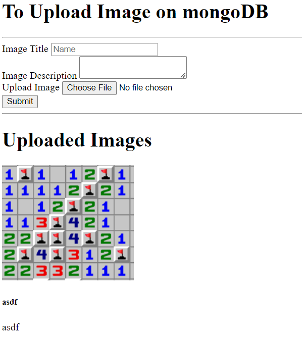

## inserting image to MongoDB

views/imagePage.ejs
```ejs
<!DOCTYPE html>
<html lang="en">
<head>
    <meta charset="UTF-8" />
    <meta name="viewport" content="width=device-width, initial-scale=1.0" />
    <title>Image Uploading</title>
</head>

<body>
<h1>To Upload Image on mongoDB</h1>
<hr />
<div>
    <form action="/" method="POST" enctype="multipart/form-data">
        <div>
            <label for="name">Image Title</label>
            <input
                    type="text"
                    id="name"
                    placeholder="Name"
                    value=""
                    name="name"
                    required
            />
        </div>
        <div>
            <label for="desc">Image Description</label>
            <textarea
                    id="desc"
                    name="desc"
                    value=""
                    rows="2"
                    placeholder="Description"
                    required
            >
          </textarea>
        </div>
        <div>
            <label for="image">Upload Image</label>
            <input type="file" id="image" name="image" value="" required />
        </div>
        <div>
            <button type="submit">Submit</button>
        </div>
    </form>
</div>

<hr />

<h1>Uploaded Images</h1>
<div>
    <% items.forEach(function(image) { %>
    <div>
        <div>
            ;base64,
                    <%=image.img.data.toString('base64')%>"
            />
            <div>
                <h5><%= image.name %></h5>
                <p><%= image.desc %></p>
            </div>
        </div>
    </div>
    <% }) %>
</div>
</body>
</html>
```

app.js
```js
var express = require('express')
var app = express();
var bodyParser = require('body-parser');
var mongoose = require('mongoose')
var imgSchema = require('./model.js');
var fs = require('fs');
var path = require('path');
app.set("view engine", "ejs");
require('dotenv').config();

mongoose.connect(process.env.MONGO_URL)
    .then(() => console.log("DB Connected"))

app.use(bodyParser.urlencoded({ extended: false }))
app.use(bodyParser.json())

var multer = require('multer');

var storage = multer.diskStorage({
    destination: (req, file, cb) => {
        cb(null, 'uploads')
    },
    filename: (req, file, cb) => {
        cb(null, file.fieldname + '-' + Date.now())
    }
});

var upload = multer({ storage: storage });

app.get('/', (req, res) => {
    imgSchema.find({})
        .then((data, err)=>{
            if(err){
                console.log(err);
            }
            res.render('imagepage',{items: data})
        })
});


app.post('/', upload.single('image'), (req, res, next) => {
    var obj = {
        name: req.body.name,
        desc: req.body.desc,
        img: {
            data: fs.readFileSync(path.join(__dirname + '/uploads/' + req.file.filename)),
            contentType: 'image/png'
        }
    }
    imgSchema.create(obj)
        .then ((err, item) => {
            if (err) {
                console.log(err);
            }
            else {
                // item.save();
                res.redirect('/');
            }
        });
});

var port = process.env.PORT || '3000'
app.listen(port, err => {
    if (err)
        throw err
    console.log('Server listening on port', port)
})
```

model.js
```js
var mongoose = require('mongoose');
var imageSchema = new mongoose.Schema({
    name: String,
    desc: String,
    img:
        {
            data: Buffer,
            contentType: String
        }
});

module.exports = mongoose.model('Image', imageSchema);
```

이 프로그램을 실행시키면 다음과 같은 결과가 나온다.


reference : https://www.geeksforgeeks.org/upload-and-retrieve-image-on-mongodb-using-mongoose/

## JavaBeans
JavaBeans는 자바로 작성된 소프트웨어 컴포넌트이다. EJB와 혼동되어서느 안되며, EJB는 JavaEE의 일부이다. 

lombok을 사용하면 엄청난 개꿀을 빨 수 있다. 
```java
package com.example.demo;

import lombok.*;
import java.time.LocalDateTime;

@NoArgsConstructor
@RequiredArgsConstructor
@Getter
@Setter
@EqualsAndHashCode(of="boardNo")
@ToString

public class Board implements java.io.Serializable {
    private int boardNo;
    @NonNull
    private String title;
    private String content;
    private String writer;
    private LocalDateTime regDate;
}
```

이 코드로 인자가 없는 생성자를 생성했고, (``@NoArgsConstructor``) 
필요한 생성자만 인자로 받는 생성자를 생성했고, (``@RequirdArgsConstructor``)
자바의 equals() 메서드와 hashCode() 메서드를 생성했고, (``@EqualsAndHashCode``)
``@Getter``와 ``@Setter``를 지정해 주었으며, 
``@toString``이 구현되어 있다. 

~~**이 모든 것을 ``@Data``로 해결할 수 있다!**~~

[익명의 누군가에게 이러면 안된다는 이야기를 들었다.](https://kwonnam.pe.kr/wiki/java/lombok/pitfall#data_사용금지)

