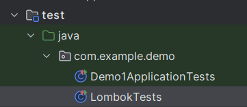

## Test Lombok
Intellij에서는 다음과 같이 테스트 src 폴더를 통해 클래스들을 테스트 해볼 수 있도록 환경이 준비되어 있다.



### lombok functions (continue)
1. ToString에서 exclude를 통해 출력에서 지외한 요소를 선책할 수 있다. 
2. EqualsAndHashCode of를 통해 해시를 걸어둘 값을 지정할 수있다. 
3. @Builder 애노테이션으로 Board를 빌드할 수 있도록 도와주는 코드를 작성할 수 있다. 가급적 클래스 보다는 직접 만든 생성자 혹은 static 객체 생성 메소드에 붙이는 것을 권장한다.
4. @Slf4j를 통해 로깅을 할 수 있다. 
5. @RequestMapping을 통해 컨트롤러에서 뷰들을 매칭할 수 있다. 

## Mapping 

```java
package com.example.demo.controller;

import lombok.extern.slf4j.Slf4j;
import org.springframework.stereotype.Controller;
import org.springframework.web.bind.annotation.RequestMapping;

@Slf4j
@Controller
@RequestMapping("/board")
public class BoardController {
    @RequestMapping("/register")
    public void registerForm() {
        log.info("registerForm");
    }
    @RequestMapping("/modify")
    public void modifyForm() {
        log.info("modifyForm");
    }
    @RequestMapping("/list")
    public void List() {
        log.info("list");
    }
}
```

**``@controller``를 지정해줘야 매핑이 작동되니 잊지 않도록 하자.**
