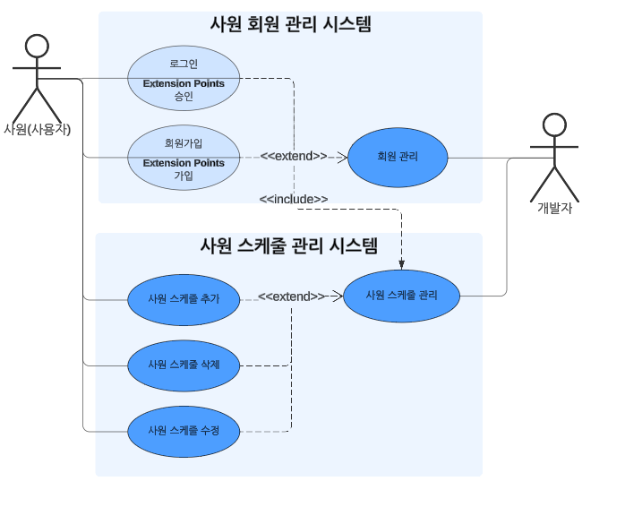
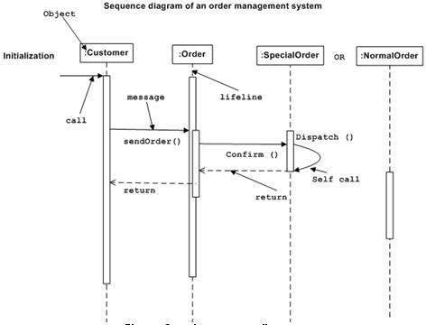
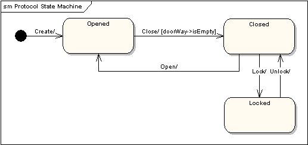
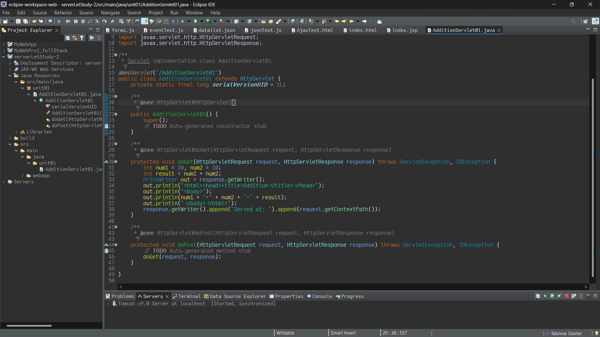
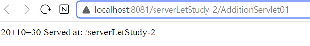
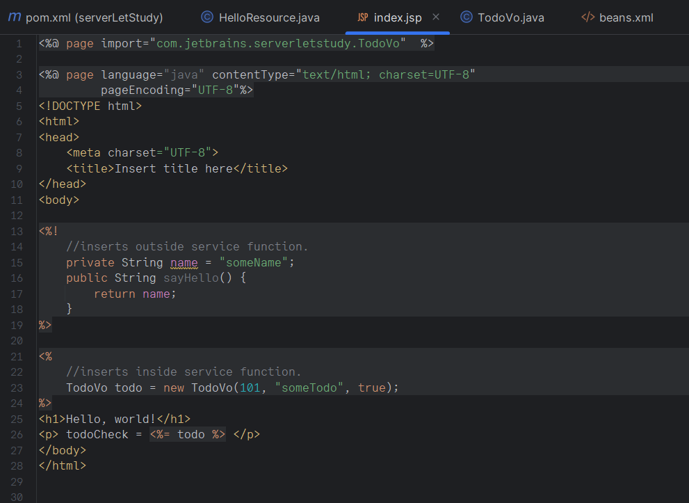

# 객체지향 소프트웨어 공학 예습 - UML

## Use case Diagram
고객, 개발자, 관리자, 사업가 등등 각각 이 프로젝트에 참여하게 되는 사람들이 사용하게 될 예정인 케이스들에 대해서 다이어그램을 그래보는 것이다.

## Class Diagram
각 클래스가 어떻게 상속되고 있는지 대략적인 코드를 작성하는 것이다.

## Sequence Diagram
연속적인 시간 상황 시나리오에서 어떤 방식으로 상호 작용이 발생하는지 확인하는 것이다.

## State Machine Diagram
시스템이 조건에 따라 어떻게 상황을 결정하는지 확인하는 것이다.

# Serverlet Study

## ServerLet & JSP

Tomcat을 활용하여 serverLet 환경을 활용해 JSP가 작동되도록 실행해보자.

사용하려는 프로젝트에서 new Serverlet을 사용하도록 하면 자동으로 serverlet을 위한 파일이 생성된다.

다음 코드에 대한 결과는 이곳에서 볼 수 있다. 

``<%!`` 와 ``<%``를 통해서 java 코드를 jsp에서 작성할 수 있다.

# Spring Boot Study

