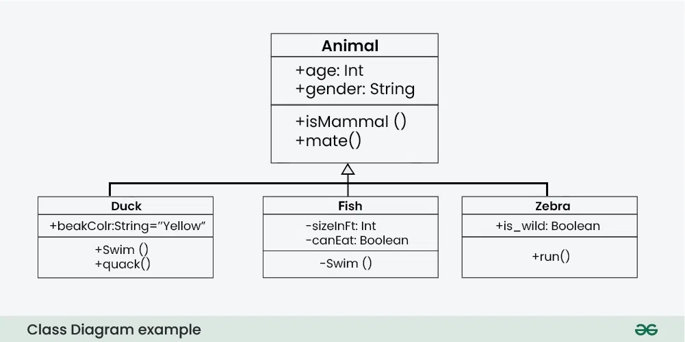

## 객체지향 소프트웨어 공학 예습 - UML

## Use case Diagram
고객, 개발자, 관리자, 사업가 등등 각각 이 프로젝트에 참여하게 되는 사람들이 사용하게 될 예정인 케이스들에 대해서 다이어그램을 그래보는 것이다.

(사용자와 웹 개발자의 일반적인 표시로는 사람 표시가 되어 있다. 사이트에서 지원되지 않으니 편의상 노란색 동그라미로 표기한다.)

## Class Diagram
각 클래스가 어떻게 상속되고 있는지 대략적인 코드를 작성하는 것이다.

## Sequence Diagram
연속적인 시간 상황 시나리오에서 어떤 방식으로 상호 작용이 발생하는지 확인하는 것이다.

## State Machine Diagram
시스템이 조건에 따라 어떻게 상황을 결정하는지 확인하는 것이다.

