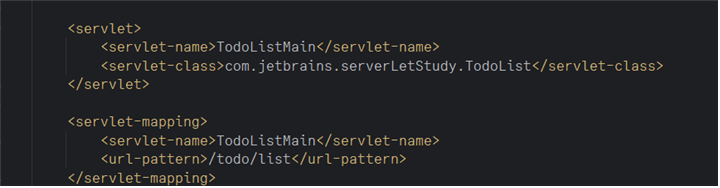

## ServLet & JSP

다음과 같은 방식으로 @ServerLet() 없이 web.xml을 생성하여 사이트를 이동시킬 수 있다.

## getAttribute, getParameter, doGet, doPost, ...
ServLet의 핵심 요소들이다. 
메소드로 바뀌어서 난해하게 보이겠지만.
**조금만 생각하면 node.js에서 서버 보내는 방식과 상당히 유사하다.**

1. Node.js : Body를 통해 request를 보내고 받기, form을 통해 resquest를 Parameter로 받기   => ServLet & JSP : getAttribute(), setAttribute(), getParameter()
2. Node.js : router.route(URL).get(function(req, res) {})  => ServLet & JSP : doGet(HttpServletRequest req, HttpServletResponse resp)

