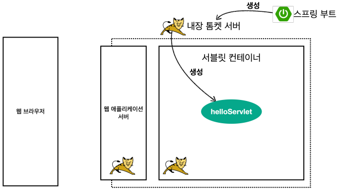
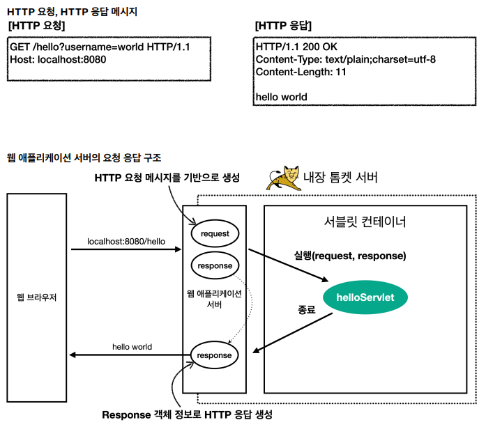

>김영한님의 인프런 강의 [스프링 MVC 1편 - 백엔드 웹 개발 핵심 기술](https://www.inflearn.com/course/%EC%8A%A4%ED%94%84%EB%A7%81-mvc-1/dashboard)을 보고 학습 내용을 정리한 글입니다.

지난 글에서 간단하게 살펴본 서블릿에 관한 내용이다.

# 서블릿, 서블릿 컨테이너

## 서블릿이란?
>동적 웹 페이지를 만들 때 사용되는 자바 기반의 웹 애플리케이션 프로그래밍 기술.
웹 요청과 응답의 흐름을 간단한 메서드 호출만으로 체계적으로 다룰 수 있게 해준다.

ex) 로그인 요청 : 서버가 클라이언트에서 입력되는 아이디와 비밀번호를 확인하고 결과를 응답.

## 서블릿 컨테이너란?
>서블릿들의 생성, 실행, 파괴를 담당한다.
서블릿을 호출하고 request, response를 넘겨준 후 필요한 작업을 진행한다.

## 동작 과정

1. 웹 브라우저(client)가 HTTP 요청.
2. WAS(톰켓)이 내장하고 있는 서블릿 컨테이너로 전달(request, response)
3. 서블릿 컨테이너가 서블릿을 싱글톤으로 생성. HttpServletRequest, HttpServletResponse를 요청이 들어올 때 마다 생성.
4. 서블릿을 호출하고 요청(request, response)를 넘겨준 후, response를 이용하여 HTTP응답 메시지를 작성하여 웹 브라우저에 전송.

# HttpServletRequest
개발자가 HTTP요청 메시지를 편리하게 조회하기 위해 사용되는 **객체**.
``서블릿``은 HTTP요청 메시지를 개발자 대신 파싱해주고, **파싱한 결과**를 ``HttpServletRequest``객체에 담아서 제공.

## HTTP 요청 데이터
### 1. GET - 쿼리 파라미터
**메시지 바디 없이** url에 ``쿼리 파라미터 형식``으로 데이터를 전송.
ex) http://localhost:8080/request?username=user&age=20

### 2. POST - HTML Form
HTML의 Form을 사용해 서버로 데이터를 전송하는 방식
**메시지 바디에** ``쿼리 파라미터 형식``으로 데이터를 전송

### 3. API 메시지 바디 - HTTP message body에 데이터를 직접 담아서 요청
주로 ``JSON``데이터 형식을 사용.
JSON 결과를 파싱해서 사용할 수 있는 자바 객체로 변환하려면 Jackson, Gson 같은 JSON 변환 라이브러리를 추가해서 사용해야 한다.
스프링 부트로 Spring MVC를 선택하면 기본으로 Jackson 라이브러리( ObjectMapper )를 함께 제공한다.

# HttpServletResponse
## HttpServletResponse 역할
### 1. HTTP 응답 메시지 생성
HTTP 응답코드 지정 ex) 100~500코드
헤더 생성
바디 생성

### 2. 편의 기능 제공
Content-Type 지정
쿠키 기능
**redirect**
