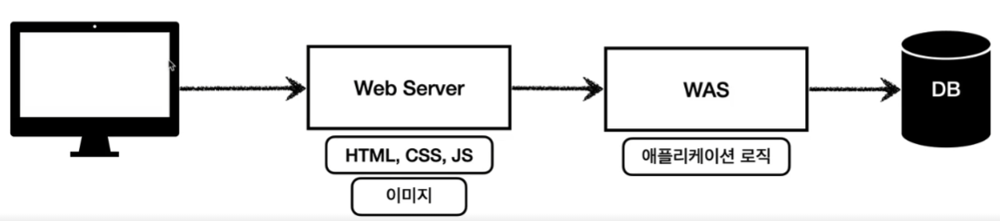
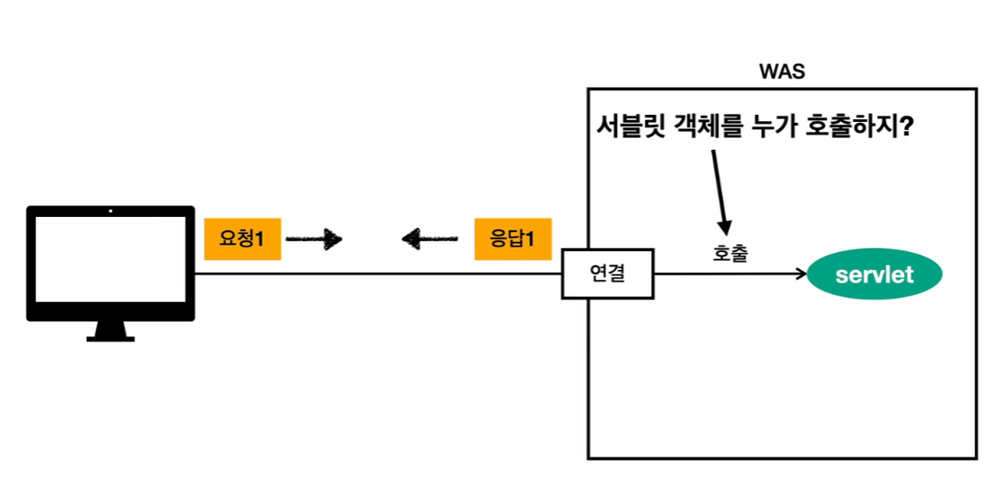

# Web Server & Web Application

## Web Server(WS)
- HTTP 기반으로 동작
- 정적 리소스 제공(HTML, CSS, JS, 이미지 등)
- 예 APACHE

## Web Application Server(WAS)
- HTTP 기반으로 동작
- 웹 서버 기능 포함 + 애플리케이션 로직 수행에 특화
- 예 톰켓 Jetty

## WAS,DB로 구성한 최소한의 웹 시스템

- WAS가 너무 많은 역할을 담당(정적 리소스 제공, 애플리케이션 로직) -> 서버 과부화 우려
- WAS 장애시 오류 화면 노출 불가능

## WS,WAS,DB로 구성한 웹 시스템

- 정적 리소스는 WS가 제공, 애플리케이션 로직(동적인 처리)은 WAS가 처리 -> 과부화 부담 경감
- 리소스 관리가 용이(정적 리소스 비중이 높을 시 WS증설, 애플리케이션 리소스 처리 비중이 높을 시 WAS증설)
- WAS 장애시 오류 화면 제공 가능

# 서블릿
WAS를 직접 전부 구현할 경우

서블릿 적용

서블릿은 **개발자가 핵심 비즈니스 로직을 구현하는 데에 집중**할 수 있게 HTTP 스팩을 편리하게 사용할 수 있게 해 주는것.

## 동작과정

HTTP 요청이 들어올 시
1. 서블릿 컨테이너가 새로운 Request, Response객체를 생성.
2. 서블릿 컨테이너에서 해당 URL에 맞는 서블릿을 실행하고, 개발자는 Request객체에서 HTTP요청 정보를 편리하게 꺼내서 사용, Response객체에 HTTP응답 정보를 편리하게 입력.
3. 서블릿 컨테이너는 Response 객체에 담겨있는 내용으로 http응답 정보를 생성 -> HTTP응답 메시지를 만들어서 브라우저에 전달.

## 서블릿 컨테이너
- 서블릿을 지원하는 WAS(ex 톰캣)
- 서블릿 객체의 생명주기(생성, 초기화, 호출, 종료)를 관리.
- 동시 요청을 위한 멀티 쓰레드를 처리 지원한다.
- 서블릿 객체는 **싱글톤**으로 생성되고 관리된다.

##  서블릿 객체
- 최초 로딩 시점에 서블릿 객체를 미리 생성(요청 시마다 재생성은 비효율)후 재활용
- 모든 고객 HTTP요청은 동일한 서블릿 객체 인스턴스에 접근하므로 공유 변수 사용 주의
- 서블릿 컨테이너 종료시 함께 종료

## 쓰레드
>쓰레드 : 애플리케이션 코드를 하나하나 순차적으로 실행하는 것

- 예) 자바 메인 메서드를 처음 실행하면 main이라는 이름의 쓰레드가 실행
- 한번에 하나의 코드 라인만 수행 가능
- 동시 처리가 필요한 경우 쓰레드를 추가로 생성 가능

사용자 요청을 WAS가 받으면 쓰레드가 servlet을 호출한다.
동시에 여러 사용자가 요청을 보낼 경우 여러개의 쓰레드를 사용해야 하는데 이것을 멀티 쓰레드라고 한다.

## 사용자 요청 마다 쓰레드 생성

### 장점
- 동시 요청 처리 가능
- 리소스(cpu,메모리)가 허용할 때 까지 처리 가능
- 하나의 쓰레드가 지연 되어도, 나머지 쓰레드 정상 동작

### 단점
- 쓰레드는 생성 비용이 매우 비싸다.
    - 고객의 요청이 올 때 마다 쓰레드를 생성 -> 응답 속도 저하로 이어진다.
- 컨텍스트 스위칭 비용이 발생
- 과한 쓰레드 생성은 cpu, 메모리 임계점을 넘겨 서버를 죽일 수 있다.

## 쓰레드 풀을 이용한 요청 처리

쓰레드 풀이 쓰레드를 보관, 관리
쓰레드 풀에 생성 가능한 쓰레드의 최대치를 관리, 톰캣은 최대 200개 기본 설정(변경 가능)

### 처리 과정
- 쓰레드가 필요한 경우 쓰레드 풀에서 쓰레드를 꺼내서 사용
- 사용 후 쓰레드는 쓰레드 풀에 반납.
- 쓰레드 풀에 있는 쓰레드가 모두 사용중이면 요청을 거절하거나 요청을 대기하도록 설정 가능.

### 장점
- 미리 쓰레드를 생성하므로 쓰레드 생성/종료 비용이 절약 -> 성능 향상

## 쓰레드 풀 팁
WAS의 주요 튜닝 포인트는 최대 쓰레드 수
- 최대 쓰레드 수가 너무 낮게 설정될 경우 -> 동시 요청이 많으면 서버 리소스는 여유롭지만 클라이언트 응답이 지연.
- 최대 쓰레드 수가 너무 높게 설정될 경우 -> 동시 요청이 많으면 리소스 임계점을 초과하여 서버가 다운.

결론 : 쓰레드 풀이 최대 쓰레드 개수를 성능 테스트를 통해 적절하게 설정되게 해야 한다.