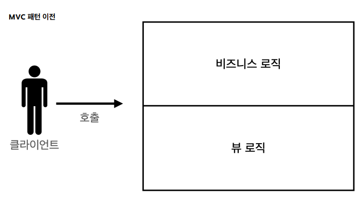
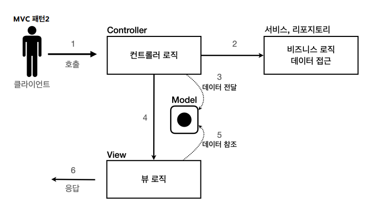

# 템플릿앤진의 등장배경
## 해결된 문제
```servlet``` 덕분에 동적으로 원하는 HTML을 마음껏 만들 수 있다.

## 발견된 문제
**코드가 매우 복잡하고 비효율** 적이다.
자바 코드에 HTML을 만들어 내는 코드를 삽입하는 것 보다 차라리 HTML문서에 동적으로 변경해야 하는 부분만 자바 코드를 넣을 수 있으면 더 편리할 것이다.

## 해결책
템플릿 엔진을 사용하자.
>템플릿 엔진 : HTML문서에서 필요한 곳만 코드를 적용해서 동적으로 변경. (JSP, Thymeleaf, Freemarker, Velocity등)

# 서블릿, JSP의 한계

## 해결된 문제
```탬플릿 엔진```을 사용한 덕분에 뷰를 생성하는 HTML 작업을 깔끔하게 가져가고, 중간중간 동적으로 변경이 필요한 부분에만 자바 코드를 적용하였다.
## 발견된 문제
하지만 JAVA코드, 리포리지토리 등 다양한 코드가 JSP에 노출되는 문제가 있다 (보안상 문제). 또, JSP가 너무 많은 역할을 수행한다(유지보수의 문제).
## 해결책
결론: 비즈니스 로직은 서블릿에서, JSP는 목적에 맞게 화면을 그리는 일에 집중하기 위해 ```MVC패턴```이 등장하였다.

# MVC패턴
## MVC패턴 적용 이전


### 이전의 문제점.

#### 1. 너무 많은 역할
하나의 서블릿, JSP만으로 비즈니스 로직과 뷰 렌더링까지 모두 처리(너무 많은 역할) -> 유지보수의 어려움.

#### 2. 변경의 라이프 사이클
UI를 수정하는 일과 비즈니스 로직을 수정하는 일은 각각 다르게 발생할 가능성이 매우 높으며, 서로에게 영향을 주지 않을 확률이 높다(각각의 라이프사이클이 다름). 라이프 사이클이 다른 부분을 하나의 코드로 관리하는 것역시 유지보수에 않좋다.

#### 3. 기능 특화
JSP같은 뷰 템플릿은 화면을 렌더링 하는데 최적화, 고로 해당하는 업무만 담당하는 것이 가장 효과적.

## 적용 이후 동작 방식


1. 클라이언트가 컨트롤러를 호출하면, 컨트롤러는 검증을 진행(고객이 제대로 요청한 것인지, HTTP요청이 제대로 맞는지)
2. 검증을 통과하면 서비스, 리포지토리를 활용하여 비즈니스 로직과 데이터 접근을 실행히거 결과를 컨트롤러에 반환
3. 반환 받은 결과를 모델에 전달
4. 뷰 로직을 호출
5. 뷰 로직이 모델에 담긴 값을 활용하여 응답을 작성후 클라이언트에게 반환.

## MVC 패턴 - 적용
>서블릿 - 컨트롤러
JSP - 뷰
HttpServletRequest 객체 - 모델

request는 내부에 데이터 저장소를 가지고 있는데,request.setAttribute(), request.getAttribute() 를 사용하면 데이터를 보관하고, 조회할 수 있다.


### redirect vs forward
redirect: 실제 클라이언트(웹 브라우저)에 응답이 나갔다가, 클라이언트가 redirect 경로로 다시 요청한다. -> 클라이언트가 인지할 수 있고, URL 경로도 실제로 변경.
foward: 서버 내부에서 일어나는 호출이기 때문에 클라이언트가 전혀 인지하지 못한다.

## MVC 패턴 - 한계

### 1. foward 중복
View로 이동하는 코드가 항상 중복 호출되어야 한다. 메서드로 공통화가 가능하지만, 해당 메서드도 항상 직접 호출해야 함.
>equestDispatcher dispatcher = request.getRequestDispatcher(viewPath);
dispatcher.forward(request, response);

### 2. ViewPath에 중복
>String viewPath = "/WEB-INF/views/new-form.jsp";

>prefix: /WEB-INF/views/
suffix: .jsp

템플릿 엔진을 변경 시 전체 코드를 다 변경해야 하는 문제가 있다.

### 3. 사용하지 않는 코드
다음 코드를 사용할 때도 있고, 사용하지 않을 때도 있다. 특히 response는 현재 코드에서 사용되지 않는다.

>HttpServletRequest request, HttpServletResponse response

그리고 이런 HttpServletRequest , HttpServletResponse 를 사용하는 코드는 테스트 케이스를 작성하기도 어렵다.

### 결론: 공통 처리가 어렵다
프로젝트의 규모가 커져 기능이 복잡해질 수록 공통으로 처리해야 하는 코드가 증가한다. 공통 메서드로 추출한하 한들, 해당 메서드를 항상 호출해야 하며, 개발자의 실수로 호출을 하지 않을 경우 문제가 발생.

공통 처리 문제를 해결하기 위해 ```프론트 컨트롤러 패턴```을 도입하여 해결한다.
>프론트 컨트롤러 - 컨트롤러 호출 전에 공통 기능을 처리. 결국 여러개의 입구에서 요청이 들어왔던 문제를 하나의 입구로만 요청이 들어올 수 있게 하는 것.

스프링 MVC의 핵심도 프론트 컨트롤러에 있다.
