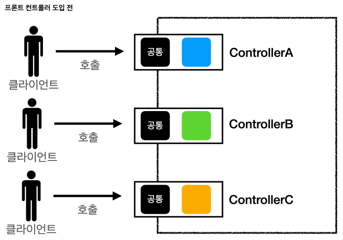
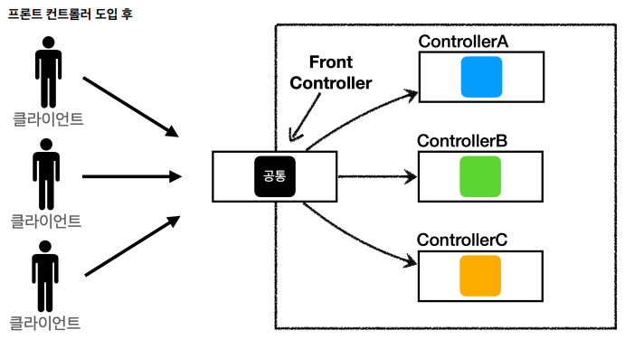
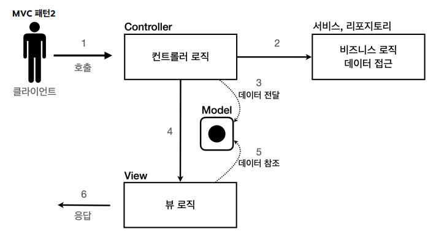

# 프론트 컨트롤러 패턴 소개
## 프론트 컨트롤러 도입 전


클라이언트가 컨트롤러를 호출 할 때 컨트롤러에서 공통으로 사용되는 로직들이 각 컨트롤러에 모두 구현되어 있다. (ex. 서블릿 동작, view호출 등)

## 프론트 컨트롤러 도입 후


프론트 컨트롤러를 통해서 공통 로직을 처리하고 세부적으로 해당하는 컨트롤러를 호출한다.

## 프론트 컨트롤러의 특징
- 프론트 컨트롤러 서블릿 하나로 클라이언트의 요청을 받는다.
- 프론트 컨트롤러는 요청에 맞는 컨트롤러를 찾아서 호출한다.
- 공통 처리가 가능하다.
- 프론트 컨트롤러를 제외한 나머지 컨트롤러는 서블릿을 사용하지 않아도 된다 -> 컨트롤러를 개발할 때 근본적인 로직을 구현하는 데에 집중할 수 있다.

# 프론트 컨트롤러 적용
## V0 - 기존


MVC모델을 도입해서 개발을 진행했던 형태

## V1 - 프론트 컨트롤러 도입


### 변화
서블릿과 비슷한 모양의 **컨트롤러 인터페이스** 도입.
각 컨트롤러들은 이 인터페이스를 구현.

### 구현
**1. 매핑 정보 컨트롤러 조회**
프론트 컨트롤러에서 해당하는 컨트롤러를 찾을 수 있게 매핑정보를 삽입한다.
```
public FrontControllerServletV1() {
	controllerMap.put("/front-controller/v1/members/new-form", new MemberFormControllerV1());
	controllerMap.put("/front-controller/v1/members/save", new MemberSaveControllerV1());
	controllerMap.put("/front-controller/v1/members", new MemberListControllerV1());
}
```
**2. 컨트롤러 호출**

컨트롤러 인터페이스
```
public interface ControllerV1 {
	void process(HttpServletRequest request, HttpServletResponse response) throws ServletException, IOException;
}
```

회원을 저장하는 컨트롤러에서 구현
```
@Override
public void process(HttpServletRequest request, HttpServletResponse response) throws ServletException, IOException {
	String username = request.getParameter("username");
	int age = Integer.parseInt(request.getParameter("age"));
	Member member = new Member(username, age);
    
	memberRepository.save(member);
	request.setAttribute("member", member);
    
	String viewPath = "/WEB-INF/views/saveresult.jsp";
	RequestDispatcher dispatcher = request.getRequestDispatcher(viewPath);
	dispatcher.forward(request, response);
 }
```
프론트 컨트롤러는 인터페이스를 호출하여 구현과 상관없이 **로직의 일관성**을 가져갈 수 있다.

3. **컨트롤러에서 JSP forward**
   기존 로직을 사용하여 해당하는 컨트롤러에서 html응답을 보낸다.

## V2 - View 분리


### 변화
컨트롤러에서 dispatcher.forward()를 호출하여 view를 직접 호출하던 것을 view객체를 따로 배정하여 View로직을 담당하게 하였다.

### 구현

모든 컨트롤러에서 View로 이동하는 코드가 중복됨을 확인

MyView 객체에 viewPath를 멤버 변수, forward 하는 부분을 MyView 내의 render()함수로 만들어 컨트롤러에서 view를 분리.

```
String viewPath = "/WEB-INF/views/new-form.jsp";
RequestDispatcher dispatcher = request.getRequestDispatcher(viewPath);
dispatcher.forward(request, response);

-> return new MyView("/WEB-INF/views/new-form.jsp");
```
Controller는 MyView객체에 viewPath만 넣어서 리턴,forward() 호출할 필요가 없어진다.

프론트 컨트롤러는 컨트롤러의 호출 결과로 MyView를 반환 받는다. 그리고 view.render()를 호출하면 forward로직을 수행해서 JSP가 실행된다.

```
@Override
protected void service(HttpServletRequest request, HttpServletResponse response) throws ServletException, IOException {
	String requestURI = request.getRequestURI();
	ControllerV2 controller = controllerMap.get(requestURI);
	if (controller == null) {
		response.setStatus(HttpServletResponse.SC_NOT_FOUND);
		return;
	}

	MyView view = controller.process(request, response);
	view.render(request, response);
}
```

## V3 - 모델 추가


### 변화
#### 서블릿 종속성을 제거
요청 파라미터 정보는 자바의 Map으로 대신 넘기도록 하면 현제 구조에서는 컨트롤러가 서블릿 기술을 몰라도 동작 가능.
그리고 request 객체를 Model로 사용하는 대신에 별도의 Model 객체를 만들어서 반환하면 된다.
이렇게 하면 구현 코드도 매우 단순해지고, 테스트 코드 작성이 쉬워진다.

#### 뷰 이름 중복 제거
컨트롤러에서 지정하는 뷰 이름에 중복이 있는것을 확인.
컨트롤러에서는 뷰의 논리 이름만 반환하고 실제 위치의 뷰 이름은 프론트 컨트롤러에서 처리하도록 한다. 이렇게 하면 후에 뷰 폴더 위치가 변해도 프론트 컨트롤러만 수정하면 된다.

>/WEB-INF/views/new-form.jsp -> new-form
/WEB-INF/views/save-result.jsp -> save-result
/WEB-INF/views/members.jsp -> members

### 구현
1. 컨트롤러 조회
2. 컨트롤러 호출
   파라미터 정보를 담은 맵을 넘겨준다.
3. ModelView 반환
   request의 Model 대신 ModelView 객체를 생성하고 데이터, view의 논리적 이름 담아 반환한다.
   이를 통해 컨트롤러는 서블릿 종속성에서 벗어날 수 있다.
```
public class MemberListControllerV3 implements ControllerV3 {
	private MemberRepository memberRepository = MemberRepository.getInstance();
	@Override
	public ModelView process(Map<String, String> paramMap) {
    	List<Member> members = memberRepository.findAll();
		ModelView mv = new ModelView("members");
        
        mv.getModel().put("members", members);
        return mv;
	}
}
```

4. ViewResolver호출
   viewResolver를 호출하여 뷰의 논리적 이름을 실제 뷰 이름으로 바꾸고 MyView 객체를 반환.

5. MyView 반환

6. render(Model) 호출
   파라미터로 modelView를 넘겨 request.setAttribute()로 전달할 데이터를 담아둔다. 그 후 jsp forward를 한다.

## V4 - 단순하고 실용적인 컨트롤러


### 변화
개발자의 편의성을 위해 반환값은 논리 이름으로 하고, controller의 parameter로 model을 추가적으로 넘겨주는 방식을 취함.

## V5 - 유연한 컨트롤러


### 변화
어댑터 패턴을 적용
지금까지 우리가 개발한 프론트 컨트롤러는 한가지 방식의 컨트롤러 인터페이스만 사용할 수 있다.
ControllerV3 , ControllerV4 는 완전히 다른 인터페이스이다. 따라서 호환이 불가능하다.
어댑터 패턴을 사용해서 프론트 컨트롤러가 다양한 방식의 컨트롤러를 처리할 수 있도록 변경하였다.

### 구현
핸들러 어댑터: 중간에 어댑터 역할을 하는 어댑터가 추가. 여기서 어댑터 역할을 해주는 덕분에 다양한 종류의 컨트롤러를 호출할 수 있다.
핸들러: 컨트롤러의 이름을 더 넓은 범위인 핸들러로 변경했다. 그 이유는 이제 어댑터가 있기 때문에 꼭 컨트롤러의 개념 뿐만 아니라 어떠한 것이든 해당하는 종류의 어댑터만 있으면 다 처리할 수 있기 때문이다.

1. 요청에 맞는 핸들러(컨트롤러)를 가져온다.
2. 가져온 핸들러를 처리할 수 있는지 핸들러 어뎁터 목록에서 확인 후 핸들러를 처리할 수 있는 어뎁터를 가져온다
3. 기존 컨트롤러와 동일한 방식으로 처리