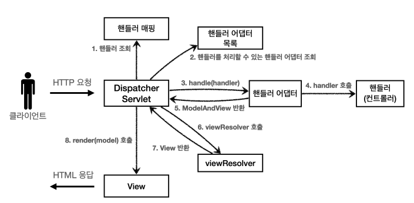

# 스프링 MVC 구조


## DispatcherServlet 구조

스프링 MVC도 프론트 컨트롤러 패턴으로 구현
스프링 MVC의 프론트 컨트롤러 - DispatcherServlet

### DispatcherServlet 서블릿 등록
- `DispatcherServlet`도 부모 클래스에서 `HttpServlet`을 상속 받아서 사용, 서블릿으로 동작
  (DispatcherServlet -> FrameworkServlet -> HttpServletBean -> HttpServlet)
- 스프링 부트는 DispatcherServlet을 서블릿으로 자동 등록 하면서 **모든 경로(urlPatterns="/")**에 대해서 매핑

### DispatcherServlet.doDispatch() 호출 흐름
- 서블릿이 호출 -> HttpServlet이 제공하는 service()가 호출됨.
- 스프링 MVC는 DispatcherServlet의 부모인 `FrameworkServlet`에서 `service()`를 오버라이드 되어 있음.
- FrameworkServlet.service()를 시작으로 메서드들이 호출되면서 doDispatch()가 호출

### doDispatch()호출 후 동작 순서
1. 핸들러 조회 : 핸들러 매핑을 통해 요청한 url에 맞게 매핑된 핸들러 조회
2. 핸들러 어뎁터 조회 : 핸들러를 실행할 수 있는 핸들러 어뎁터를 찾는다.
3. 핸들러 어댑터 실행 : 조회한 핸들러 어뎁터를 실행한다.
4. 핸들러 실행 : 핸들러 어뎁터가 실제 핸들러를 실행한다.
5. ModelAndView 반환 : 핸들러 어뎁터는 반환 정보를 ModelAndView로 변환해서 리턴한다.
6. viewResolver호출 : 뷰 리졸버를 찾고 실행
7. View반환 : 뷰 리졸버를 이용해 뷰 논리 이름을 뷰 물리 이름으로 바꾸고, 뷰 객체를 리턴한다.
8. 뷰 렌더링 : 뷰를 통해 뷰를 렌더링 한다.

### 주요 인터페이스 목록
핸들러 매핑: `org.springframework.web.servlet.HandlerMapping`
핸들러 어댑터: `org.springframework.web.servlet.HandlerAdapter`
뷰 리졸버: `org.springframework.web.servlet.ViewResolver`
뷰: `org.springframework.web.servlet.View`

## 핸들러 매핑과 핸들러 어댑터
컨트롤러가 호출되려면 2가지가 필요.

- HandlerMapping(핸들러 매핑)
    - 핸들러 매핑에서 이 컨트롤러를 찾을 수 있어야 한다.
- HandlerAdapter(핸들러 어댑터)
    - 핸들러 매핑을 통해서 찾은 핸들러를 실행할 수 있는 핸들러 어댑터가 필요.

이미 스프링은 필요한 핸들러 매핑과 핸들러 어댑터를 대부분 구현해 두었다. 개발자가 직접 핸들러 매핑과 핸들러 어댑터를 만들 일은 거의 없음.

### 스프링 부트가 자동 등록하는 핸들러 매핑과 핸들러 어댑터

#### HandlerMapping
```
0 = RequestMappingHandlerMapping : 애노테이션 기반의 컨트롤러인 @RequestMapping에서 사용
1 = BeanNameUrlHandlerMapping : 스프링 빈의 이름으로 핸들러를 찾는다.
```

#### HandlerAdapter
```
0 = RequestMappingHandlerAdapter : 애노테이션 기반의 컨트롤러인 @RequestMapping에서 사용
1 = HttpRequestHandlerAdapter : HttpRequestHandler 처리
2 = SimpleControllerHandlerAdapter : Controller 인터페이스(애노테이션X, 과거에 사용) 처리
```

핸들러 매핑도, 핸들러 어댑터도 모두 순서대로 찾고 없으면 다음 순서로 넘어간다.

1. 핸들러 매핑으로 핸들러 조회
   -> HandlerMapping을 순서대로 실행하여, 핸들러 찾는다.
2. 핸들러 어댑터 조회
   -> HandlerApdater의 supports()를 순서대로 실행하여 매핑된 핸들러 어댑터를 찾기
3. 핸들러 어댑터 실행
   -> 찾은 핸들러 어댑터를 실행하여 핸들러를 실행